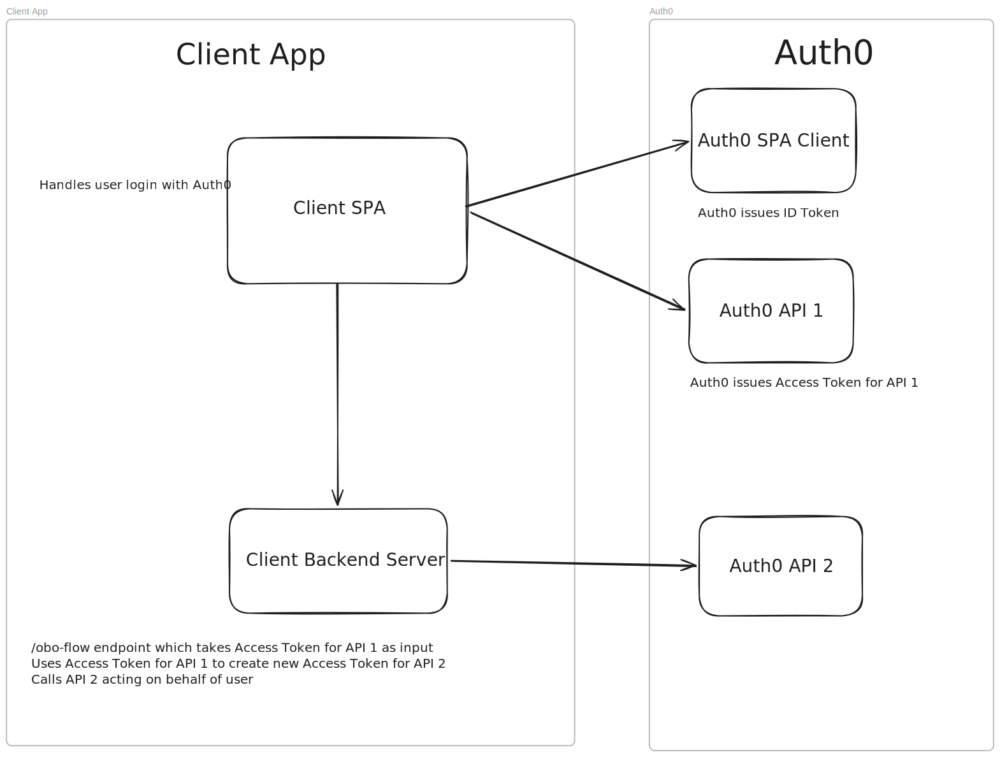

# Auth0 On-Behalf-Of (OBO) Token Exchange Sample App

Sample app for On-Behalf-Of (OBO) token exchange to enable middle-tier services to preserve user identity and permissions when calling downstream APIs.

The client sends a POST request to `http://localhost:3000/obo-flow` with accessToken for the first API in the body. The server uses this accessToken to get a new accessToken for the second API (downstream API).

Downstream Access Token:

```json
{
  "iss": "https://dev-8jc54ej0kls418wv.us.auth0.com/",
  "sub": "auth0|6a5644849b95a281210f73de",
  "aud": "https://obo-flow-api-2/",
  "iat": 1784052407,
  "exp": 1784138807,
  "act": {
    "sub": "Geht8foVugp9G0qyhTnP8tMVpDD4eLgb",
    "act": {
      "sub": "iqc51Cf3AslsCjhtiANfANu2meIGG9gd"
    }
  },
  "azp": "Geht8foVugp9G0qyhTnP8tMVpDD4eLgb"
}
```

## Getting Started

Run the server:
```bash
cd server/
npm i
npm start
```

Run the client:
```bash
cd client/
npm i
npm start
```

Open [http://localhost:5173/](http://localhost:5173/) and login.

Check console output for OBO Flow Response JSON object containing downstreamAccessToken. Decode with [jwt.io](https://www.jwt.io/).

## System Design



Diagram created using [Excalidraw](https://excalidraw.com/).
