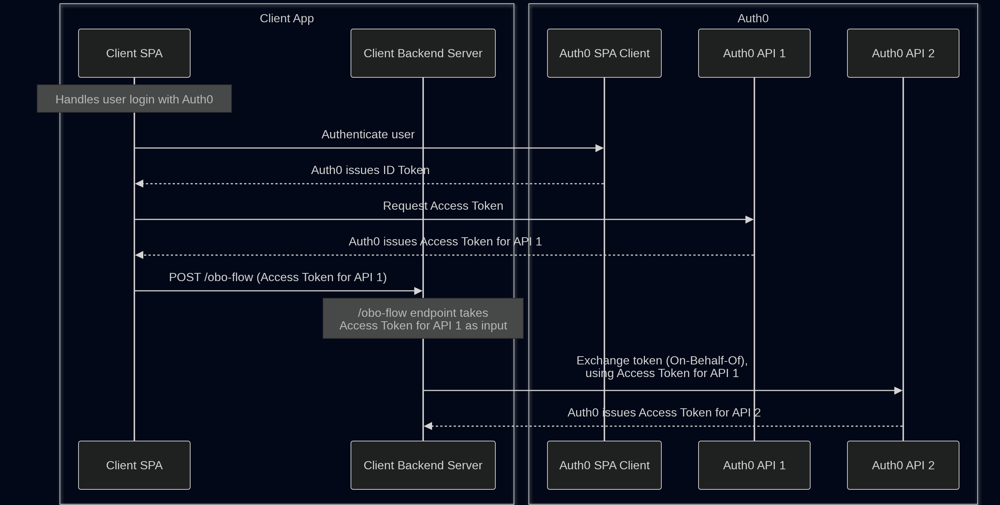

# Auth0 On-Behalf-Of (OBO) Token Exchange Sample App

Sample app for On-Behalf-Of (OBO) token exchange to enable middle-tier services to preserve user identity and permissions when calling downstream APIs.

This project demonstrates how to:
- Authenticate a user with the Authorization Code + PKCE flow
- Validate JWT access tokens in a protected middle-tier API
- Exchange the user's access token for a downstream access token using OAuth 2.0 On-Behalf-Of (OBO) Token Exchange (RFC 8693)
- Call a downstream API while preserving the user's identity and delegated permissions (scopes)
- See exactly which tokens are issued and exchanged at each step of the flow

## Getting Started

Setup
- [Deploy Auth0 Configuration](./auth0-tenant/README.md)
- [Run the server](./server/README.md)
- [Run the client](./client/README.md)

Open [http://localhost:5173/](http://localhost:5173/) and login.

Check console output for OBO Flow Response JSON object containing downstreamAccessToken. Decode with [jwt.io](https://www.jwt.io/).

## Details

The client sends a POST request to `http://localhost:3000/obo-flow` with accessToken for the first API in the body. The server uses this accessToken to get a new accessToken for the second API (downstream API).

Example downstream Access Token:
```json
{
  "iss": "https://dev-8jc54ej0kls418wv.us.auth0.com/",
  "sub": "auth0|6a5644849b95a281210f73de",
  "aud": "https://obo-flow-api-2/",
  "iat": 1784052407,
  "exp": 1784138807,
  "act": {
    "sub": "Geht8foVugp9G0qyhTnP8tMVpDD4eLgb",
    "act": {
      "sub": "iqc51Cf3AslsCjhtiANfANu2meIGG9gd"
    }
  },
  "azp": "Geht8foVugp9G0qyhTnP8tMVpDD4eLgb"
}
```

## System Design



Diagram created using [Mermaid](https://mermaid.ai/open-source/).
